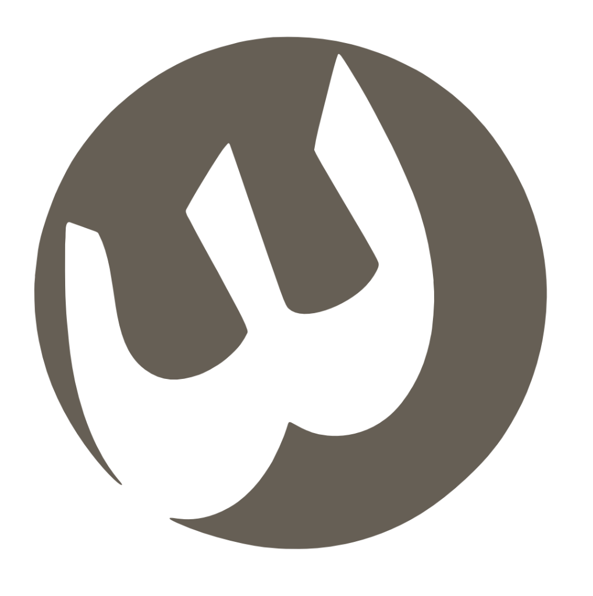

<p align="center">
  
</p>

<h1 align="center">وشّى | WASHA</h1>
<p align="center"><strong>منصة فنية رقمية للأزياء — فنٌ يرتدى</strong></p>
<p align="center">
  <a href="https://washa.shop">washa.shop</a>
</p>

---

## 🎨 نبذة

**وشّى** هي منصة أزياء فنية رقمية تجمع بين الإبداع العربي والتكنولوجيا الحديثة. تمكّن المصممين والفنانين من عرض وبيع أعمالهم، وتتيح للعملاء تصميم قطع مخصصة باستخدام الذكاء الاصطناعي.

## ⚡ التقنيات

| التقنية | الاستخدام |
|---------|-----------|
| **Next.js 14** | إطار العمل (App Router, RSC) |
| **React 18** | واجهة المستخدم |
| **TypeScript** | أمان الأنواع |
| **Supabase** | قاعدة البيانات + التخزين + RLS |
| **Clerk** | المصادقة وإدارة المستخدمين |
| **Tap Payments** | بوابة الدفع الأساسية |
| **Resend** | البريد الإلكتروني |
| **Framer Motion** | الحركات والانتقالات |
| **Zustand** | إدارة الحالة |
| **Zod** | التحقق من البيانات |
| **Recharts** | الرسوم البيانية |
| **TailwindCSS** | التنسيق |
| **Web Push** | الإشعارات الفورية |

## 🚀 التشغيل

```bash
# تثبيت التبعيات
npm install

# تشغيل بيئة التطوير
npm run dev

# بناء الإنتاج
npm run build

# تشغيل الإنتاج
npm start
```

## 🔑 المتغيرات البيئية

أنشئ ملف `.env.local` في الجذر:

```env
# Supabase
NEXT_PUBLIC_SUPABASE_URL=
NEXT_PUBLIC_SUPABASE_ANON_KEY=
SUPABASE_SERVICE_ROLE_KEY=

# Clerk
NEXT_PUBLIC_CLERK_PUBLISHABLE_KEY=
CLERK_SECRET_KEY=
CLERK_WEBHOOK_SIGNING_SECRET=

# Tap Payments
TAP_SECRET_KEY=sk_test_xxxx
TAP_MERCHANT_ID=merchant_id_from_tap_dashboard
NEXT_PUBLIC_TAP_PUBLIC_KEY=pk_test_xxxx

# Stripe (قديم — لاستقبال العمليات السابقة فقط)
STRIPE_SECRET_KEY=
STRIPE_WEBHOOK_SECRET=
NEXT_PUBLIC_STRIPE_PUBLISHABLE_KEY=

# Resend (Email)
RESEND_API_KEY=
EMAIL_FROM=
ADMIN_EMAILS=
ADMIN_EMAIL=

# Web Push (VAPID)
NEXT_PUBLIC_VAPID_PUBLIC_KEY=
VAPID_PRIVATE_KEY=

# App
NEXT_PUBLIC_APP_URL=https://washa.shop
```

## 📁 هيكل المشروع

```
src/
├── app/
│   ├── (admin)/         # لوحة تحكم الأدمن
│   ├── (protected)/     # صفحات تحتاج تسجيل دخول
│   │   ├── account/     # حساب المستخدم
│   │   ├── dashboard/   # لوحة القيادة (22 قسم)
│   │   └── studio/      # استوديو الفنان
│   ├── (public)/        # الصفحات العامة
│   │   ├── products/    # المنتجات
│   │   ├── gallery/     # المعرض
│   │   ├── store/       # المتجر
│   │   ├── design/      # صمم قطعتك
│   │   └── ...
│   ├── actions/         # Server Actions (25+)
│   └── api/             # API Routes
├── components/
│   ├── admin/           # مكونات الإدارة
│   ├── design-your-piece/  # معالج التصميم
│   ├── layout/          # Header, Footer
│   ├── store/           # سلة المشتريات
│   ├── studio/          # مكونات الاستوديو
│   └── ui/              # مكونات عامة
├── context/             # سياقات React
├── lib/                 # مكتبات مساعدة
└── types/               # أنواع TypeScript
```

## 🛡️ الأمان

- **Clerk** لإدارة المصادقة
- **Supabase RLS** لحماية البيانات على مستوى الصفوف
- **Server Actions** للعمليات الحساسة
- **Stripe Webhooks** مع التحقق من التوقيع

## 📄 الترخيص

جميع الحقوق محفوظة © وشّى | WASHA
